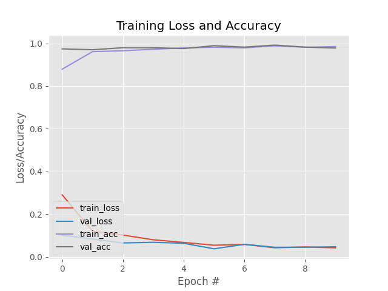

# Real-Time Face Mask Detection Web Application

A full-stack, real-time Face Mask Detection web application built using Python, Flask, OpenCV (SSD Caffe Face Detector), TensorFlow / Keras (MobileNetV2), and modern WebRTC HTML5 Canvas.



## 🌟 Key Features

- **Real-Time Browser Detection:** Uses browser WebRTC (`getUserMedia`) to capture client webcam frames locally and stream them to the prediction API, keeping bandwidth low and preserving privacy.
- **Deep Learning AI Models:** 
  - OpenCV Single Shot MultiBox Detector (SSD) with Caffe model for precise face detection.
  - Fine-tuned MobileNetV2 architecture for high-accuracy binary mask classification (Mask vs. No Mask).
- **Client-Side Canvas Overlay:** Draws color-coded bounding boxes (Green for Mask, Red for No Mask) and probability metrics dynamically on the client's screen.
- **Cloud-Ready Architecture:**
  - RESTful `/predict` JSON API endpoint using base64 image decoding.
  - WSGI integration via `gunicorn`.
  - Dockerized environment with `python:3.10-slim` and `opencv-python-headless`.
  - `Procfile` ready for direct PaaS deployments (Render, Heroku, AWS Elastic Beanstalk).

---

## 📁 Repository Structure

```
face-mask-detection/
├── app.py                 # Flask web application & REST API server
├── inference.py           # Model loader and face detection/mask prediction pipeline
├── train_model.py         # MobileNetV2 training & evaluation script
├── mask_detector.h5       # Trained Keras face mask classification model
├── face_detector/         # OpenCV Caffe Face Detector model files
│   ├── deploy.prototxt
│   └── res10_300x300_ssd_iter_140000_fp16.caffemodel
├── templates/
│   └── index.html         # Responsive web UI with webcam stream & canvas renderer
├── Dockerfile             # Container configuration for cloud deployment
├── Procfile               # Production WSGI deployment specification
└── requirements.txt       # Python dependencies
```

---

## 🚀 Quick Start (Local Setup)

### 1. Prerequisites
- Python 3.9+ installed
- Webcam connected to your computer

### 2. Installation
Clone the repository and install the dependencies:
```bash
git clone https://github.com/monish-hub-ai/face-mask-repository.git
cd face-mask-repository
pip install -r requirements.txt
```

### 3. Run the Application
```bash
python app.py
```
Open your browser and navigate to `http://localhost:5000`. Grant camera permissions when prompted.

---

## 🐳 Docker Setup

Build and run using Docker:

```bash
# Build Docker image
docker build -t face-mask-detector .

# Run Docker container
docker run -p 5000:5000 face-mask-detector
```

---

## ☁️ Cloud Deployment (Render / Heroku / AWS)

This application is pre-configured for cloud deployment:
1. **GitHub Integration:** Push this repository to GitHub.
2. **Render Deployment:**
   - Create a new **Web Service** on [Render](https://render.com).
   - Connect `monish-hub-ai/face-mask-repository`.
   - Render automatically detects the `Dockerfile` / `Procfile` and builds the service.
3. Access your live web application at your Render URL!

---

## 🧠 Model Training

To retrain the face mask detector on your custom dataset:
```bash
python train_model.py --dataset dataset
```
This will output `mask_detector.h5` and generate `plot.png` showing loss/accuracy metrics.

---

## 📄 License
This project is open source and available under the [MIT License](LICENSE).
